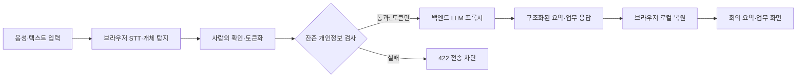

# VeilNote

민감한 회의 원문을 브라우저에서 비식별화하고, 서버와 LLM에는 토큰화된 텍스트만 전달하는 회의록·업무 실행 에이전트입니다.

코드게이트 AI 스타트업 해커톤에서 팀 TRACEGATE가 개발한 프로토타입이며, 저는 **백엔드 개발을 중심으로 API 계약과 프런트엔드 연결을 담당**했습니다.

## Project Summary

| 항목 | 내용 |
| --- | --- |
| 행사 | 코드게이트 AI 스타트업 해커톤 |
| 팀 | TRACEGATE |
| 주제 | 업무·생산성 자동화 / 회의록 정리 / 협업도구 |
| 담당 | 백엔드 API, LLM 연동, 보안 게이트, 프런트엔드 연동 |
| 핵심 가치 | 원문·매핑 테이블은 기기에 남기고 서버에는 토큰만 전송 |

## Problem

일반적인 AI 회의록 서비스는 녹음 파일이나 회의 원문을 외부 서버로 전송합니다. 기업명, 고객명, 계약 금액, 연락처가 포함된 회의에서는 이 전송 자체가 도입 장벽이 됩니다.

VeilNote는 다음 경계를 제품의 핵심 규칙으로 두었습니다.

1. 음성 인식과 개인정보 탐지는 브라우저에서 수행합니다.
2. 사용자가 탐지 결과를 직접 확인하고 수정합니다.
3. 원문을 토큰으로 치환한 뒤 잔존 개인정보를 다시 검사합니다.
4. 백엔드와 LLM에는 토큰화된 텍스트만 전달합니다.
5. 응답은 브라우저에 보관된 매핑 테이블로 화면 표시 직전에 복원합니다.

## Architecture



## My Contribution

### Backend

- 브라우저가 토큰화된 본문만 보내도록 JSON 요청 계약을 설계했습니다.
- API 키가 프런트엔드에 노출되지 않도록 LLM 호출을 백엔드 프록시로 분리했습니다.
- 한 번의 LLM 호출에서 요약, 결정사항, 액션아이템을 구조화된 JSON으로 받도록 응답 계약을 정리했습니다.
- 토큰화되지 않은 이메일·전화번호·주민등록번호·카드번호가 남으면 LLM 호출 전에 `422`로 차단하는 잔존 PII 게이트를 정의했습니다.
- 입력 오류, 존재하지 않는 업무, 잔존 PII, LLM 호출 실패를 `400`, `404`, `422`, `502`로 구분해 프런트엔드가 상황별 UI를 표시할 수 있게 했습니다.
- 회의에서 생성된 업무를 조회·수정·삭제할 수 있는 업무 대시보드 API의 v2 계약을 작성했습니다.

### Frontend Integration

- 프런트엔드의 `fetch` 요청 형식과 백엔드 응답 필드를 맞추고, 성공·차단·LLM 실패 상태를 화면에 연결했습니다.
- 브라우저에만 있는 매핑 테이블로 서버 응답을 복원해 팀 요약과 개인 STAR 문장을 표시하는 흐름을 연결했습니다.
- 토큰화·탐지·유출검사 로직을 브라우저와 서버에서 같은 규칙으로 사용할 수 있도록 공용 ESM 모듈 경로를 설계했습니다.
- 온디바이스 Whisper의 받아쓰기 결과가 개인정보 탐지와 API 요청 흐름으로 바로 이어지도록 입력 파이프라인을 연결했습니다.

## Prototype Flow

```text
마이크 입력
  -> AudioWorklet에서 PCM 프레임 수집
  -> Web Worker의 Whisper가 브라우저에서 받아쓰기
  -> 규칙 + 사전 + 온디바이스 NER로 민감정보 탐지
  -> 사용자가 탐지 결과 확인·수정
  -> 토큰화 및 역방향 유출검사
  -> 백엔드 API에 토큰화 텍스트 전송
  -> LLM 구조화 응답
  -> 브라우저에서 원문 복원 후 결과 표시
```

## API Design

프로토타입과 v2 확장 계약을 분리해 관리했습니다.

| 단계 | Method | Endpoint | 역할 |
| --- | --- | --- | --- |
| 프로토타입 연동 | `POST` | `/api/process` | 토큰화 회의문을 요약·개인 STAR 결과로 변환 |
| v2 메인 계약 | `POST` | `/api/process-meeting` | 요약·결정사항·액션아이템을 한 번에 생성 |
| 상태 확인 | `GET` | `/health` | 서비스·모델·API 키 설정 상태 확인 |
| 업무 목록 | `GET` | `/api/tasks` | 상태·담당자·회의별 필터와 집계 반환 |
| 업무 단건 | `GET` | `/api/tasks/:id` | 업무 상세 조회 |
| 업무 수정 | `PATCH` | `/api/tasks/:id` | 완료 체크, 내용·담당자·우선순위 수정 |
| 업무 삭제 | `DELETE` | `/api/tasks/:id` | 업무 삭제와 집계 재계산 |

## Security Decisions

- 원문과 토큰 매핑 테이블을 요청 본문에 포함하지 않습니다.
- 서버는 요청·응답 본문을 로그에 남기지 않는 정책을 사용합니다.
- 잔존 PII가 발견되면 LLM을 호출하지 않고 요청을 차단합니다.
- 오류 응답의 `preview`에는 원문 전체가 아니라 마스킹된 미리보기만 포함합니다.
- 복원된 결과는 다시 저장하지 않고 렌더링 직전에만 사용합니다.
- 날짜는 LLM이 절대 날짜를 만들지 않고 상대일수로 반환하게 해 브라우저가 계산합니다.

## Confirmed Prototype Code

| 파일 | 역할 |
| --- | --- |
| `public/index.html` | 동의 UI, 개인정보 탐지·검토, 토큰화 미리보기, API 호출, 로컬 복원 |
| `public/mic.js` | 마이크 캡처, 음성구간 감지, 16kHz 리샘플링, Whisper 작업 큐 |
| `public/pcm-worklet.js` | AudioWorklet 렌더 스레드에서 PCM 프레임 전달 |
| `public/whisper-worker.js` | Transformers.js Whisper 추론과 WebGPU → WASM 폴백 |

## Technology

- Frontend prototype: HTML, CSS, JavaScript
- Browser AI: `@huggingface/transformers` 3.0.2
- Speech-to-Text: `Xenova/whisper-base`
- Named Entity Recognition: `Xenova/bert-base-multilingual-cased-ner-hrl`
- Browser APIs: Web Audio API, AudioWorklet, Web Worker, Speech Synthesis
- Backend: REST/JSON LLM proxy and residual-PII guard
- v2 data design: IndexedDB with Dexie.js

## Implementation Notes

`resampleTo16k`, `concatFloat32`, `rms`, `MeetingRecorder`, `getTranscriber`는 프로젝트에서 작성한 사용자 정의 코드입니다.

`pipeline`과 `env`는 Transformers.js가 제공하고, `AudioContext`, `AudioWorkletNode`, `Worker`, `fetch`, `localStorage`, `SpeechSynthesisUtterance`는 브라우저 표준 API가 제공합니다. 라이브러리와 브라우저가 이미 제공하는 기능을 다시 구현하지 않고, 프로젝트 코드는 회의 녹음·작업 큐·보안 흐름을 조합하는 역할에 집중했습니다.

## Public Scope

현재 프로필 저장소에는 프로젝트 설명만 공개합니다. 실행 가능한 전체 프로젝트 저장소를 공개하려면 백엔드 소스, `/shared` 공용 모듈, 패키지 매니페스트, 테스트, `.env.example`을 함께 정리해야 합니다. 실제 API 키와 토큰 매핑 데이터는 공개 대상에서 제외합니다.
